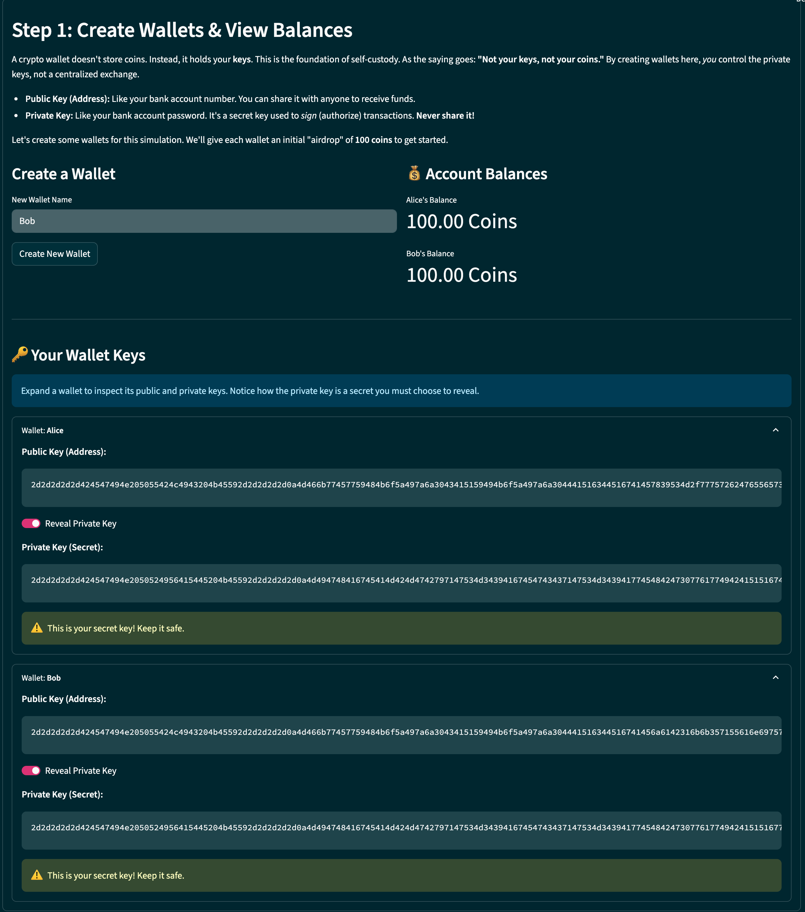
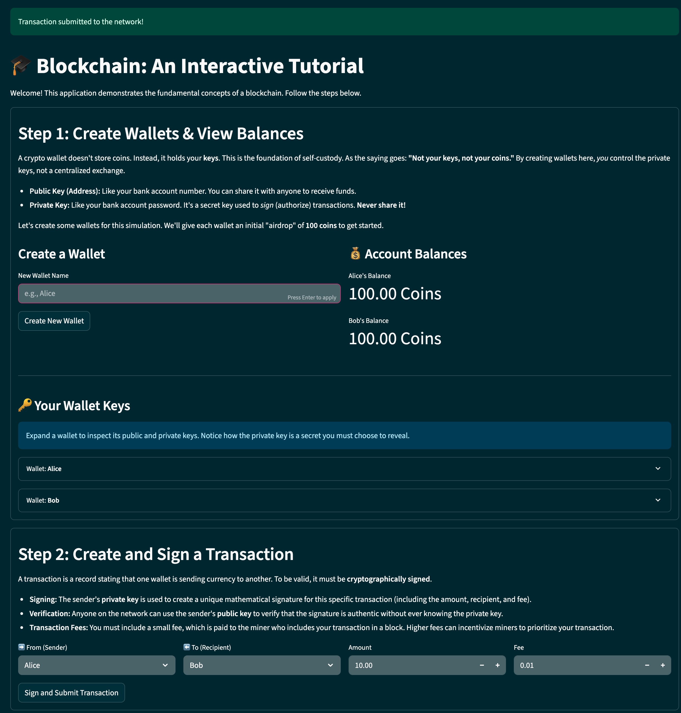
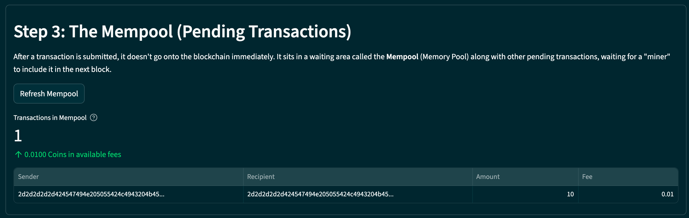
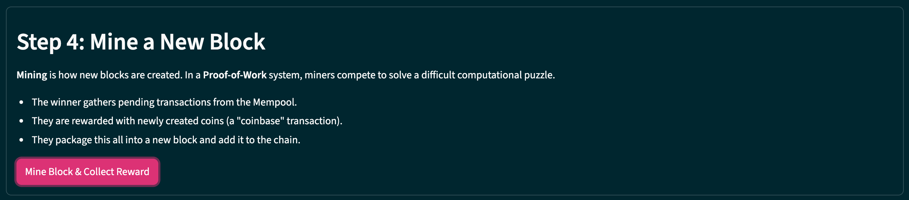
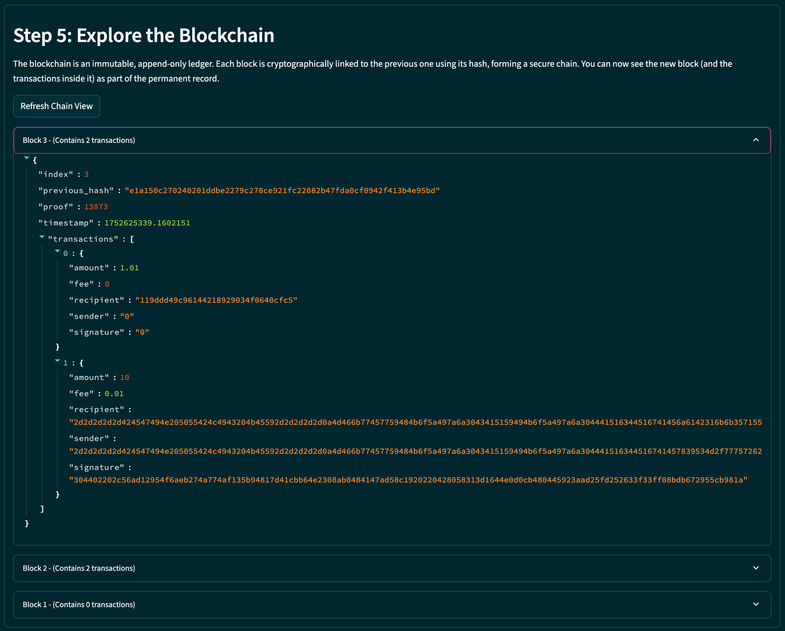

# 🎓 Blockchain: An Interactive Tutorial

 This project is a simple, educational implementation of a blockchain in Python, designed to be explored through a hands-on, interactive web dashboard built with Streamlit.

 It demonstrates the fundamental concepts of a cryptocurrency, including wallets, public/private key cryptography, transactions, mining, and network consensus.

 ## Features

 - **Interactive Dashboard**: A web-based UI to guide you through blockchain concepts step-by-step.
 - **Wallet Management**: Create cryptographic wallets and view public/private keys.
 - **Transaction Signing**: Create and cryptographically sign transactions.
 - **Mempool Visualization**: See transactions waiting to be mined.
 - **Proof-of-Work Mining**: Mine new blocks to confirm transactions and earn rewards.
 - **Chain Exploration**: View the entire blockchain, block by block.
 - **Network Simulation**: Visualize a decentralized network of nodes and run a consensus algorithm to resolve conflicts.

## 📦 Project Structure

The project follows a standard Python `src` layout to separate the installable package from application scripts.
```
Simple-Blockchain/ 
├── .streamlit/
│   └── config.toml             # Custom theme for the Streamlit dashboard
├── assets/
│   ├── step-1-wallets.png             
│   ├── step-2-transaction.png 
│   ├── step-3-mempool.png 
│   ├── step-4-mining.png 
│   └── step-5-chain-view.png 
├── src/
│   ├── simple_blockchain/      # The installable Python package
│   │   ├── __init__.py         # Makes the directory a package
│   │   ├── blockchain.py       # Core blockchain logic and Flask API endpoints
│   │   └── wallet.py           # Cryptographic wallet and signature logic
│   ├── __init__.py             # Makes the directory a package
│   ├── dashboard.py            # Main entrypoint: The Streamlit educational app
│   ├── explorer.py             # A simple web-based blockchain explorer
│   ├── example_client.py       # Script for a command-line demo
│   └── simulation.py           # Script to simulate high transaction volume
├── tests/ 
│   ├── test_api.py             # Unit tests for the Wallet class 
│   └── test_wallet.py          # Unit tests for the Wallet class 
├── .gitignore                  # Files and directories to ignore in version control
├── CHANGELOG.md                # Log of changes for each version
├── environment.yml             # Dependencies for Conda environments
├── LICENSE                     # MIT License for the project
├── pyproject.toml              # Python project configuration (for build tools)
├── README.md                   # You are here!
└── requirements.txt            # Dependencies for pip environments
```

---

## 🛠️ Getting Started

### Prerequisites

-   Python 3.9+
-   An environment manager like Conda or `venv`

### Installation

1.  **Clone the repository:**
    ```
    git clone https://github.com/dbensik/Simple-Blockchain.git
    cd Simple-Blockchain
    ```
    
2.  **Create an environment and install dependencies.** Choose one of the following methods:

    **Method A: Using Conda (Recommended)**
    ```
    conda env create -f environment.yml
    conda activate simple-blockchain-env
    ```    

    **Method B: Using pip and venv**
    This links the package to your source files, so any changes you make are immediately available.
    ```
    pip install -e .
    ```
---

## 🧪 How to Run the Interactive Tutorial

The best way to experience this project is through the Streamlit dashboard.

### Step 1: Start a Blockchain Node

First, you need to run at least one node. This is the core server that manages the blockchain.

-   Open a terminal, make sure your `simple-blockchain-env` environment is activated, and run:
    

    python -m simple_blockchain.blockchain -p 5001
    
-   **Leave this terminal running.** It is now your active blockchain node.

### Step 2: Launch the Educational Dashboard

-   Open a **new, separate terminal** and activate the environment again.
-   Run the Streamlit dashboard:
    

    streamlit run src/dashboard.py
    
-   Streamlit will automatically open a new tab in your browser. You can now follow the on-screen tutorial!

---

## 🚶 Guided Walkthrough: Your First Transaction

Follow these steps in the Streamlit dashboard to see the blockchain in action.

### 1. Create Wallets

In **Step 1** of the dashboard, create at least two wallets (e.g., for "Alice" and "Bob"). The application will generate a unique public/private key pair for each. The public key acts as the wallet's address.



### 2. Create and Sign a Transaction

In **Step 2**, set up a transaction from Alice to Bob. When you click "Sign and Submit Transaction," the app uses Alice's secret private key to create a unique digital signature, proving she authorized the payment. The transaction is then sent to the node.



### 3. View the Mempool

The transaction doesn't go onto the blockchain yet. In **Step 3**, you can see it sitting in the "Mempool," a waiting area for all pending transactions.



### 4. Mine the Block

In **Step 4**, click the "Mine Block" button. This tells the node to perform "Proof-of-Work." The node solves a computational puzzle, gathers all transactions from the mempool, and packages them into a new, secured block. For its effort, the node is rewarded with a new coin.



### 5. Verify on the Blockchain

Finally, in **Step 5**, refresh the chain view. You will now see the newly mined block at the top of the chain. If you expand it, you'll see Alice's transaction to Bob, now permanently recorded and verified on the blockchain.



---

## ✅ Running Tests

The project includes unit tests for core components. To run them, install `pytest` and execute it from the root directory.

```
pip install pytest
pytest
```
---

## 👋 About Me
I'm currently studying for CFA Level II and building technical projects like this to deepen my understanding of both finance and technology. You can find more of my work on GitHub.